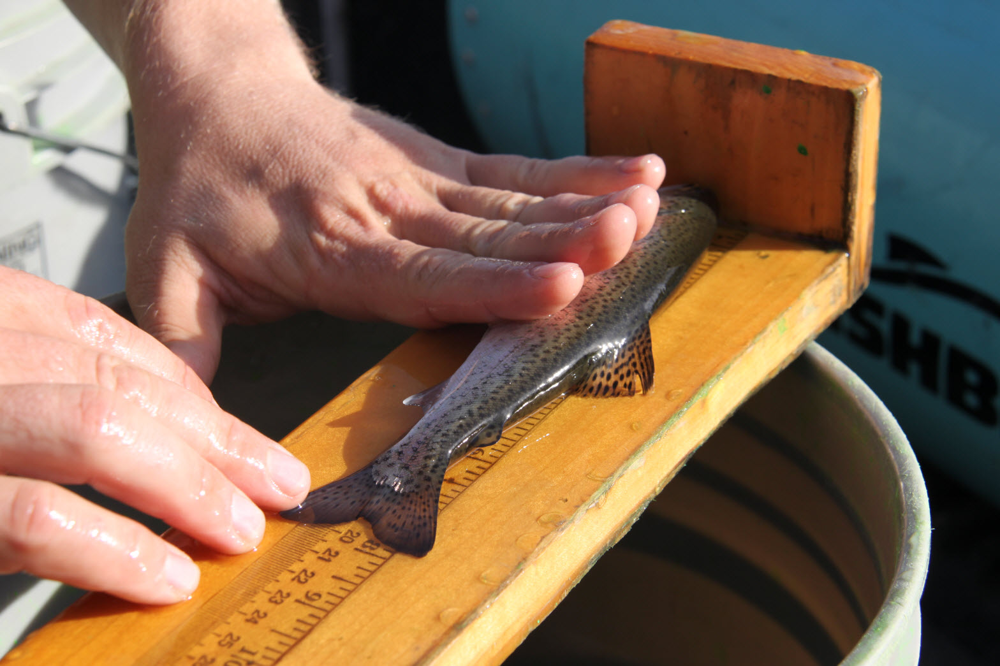
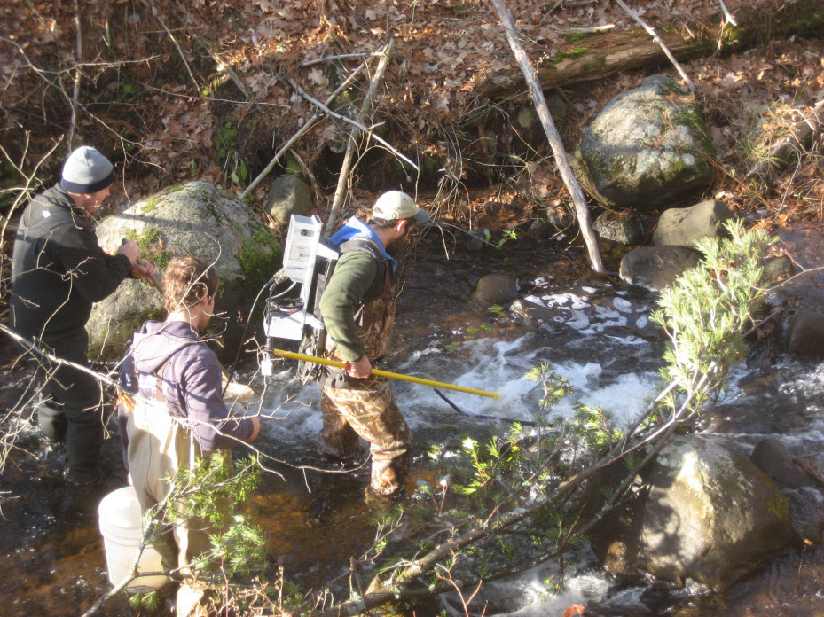

## Background
#### Motivation
Fish length is likely the information most commonly collected by fisheries biologists and managers. While length is usually not the only information collected by a fisheries biologist, summaries of length information can provide the biologist with a wealth of information on population parameters such as age distributions, growth rates, and mortality rates; the basic biology of the animal; and the effect of management regulations on the fish population. Thus, summarizing length data and then interpreting those summaries is an important task performed by fisheries biologists.

\ 

#### Setting
Whittlesey Creek is a tributary to Chequamegon Bay of Lake Superior. This stream has been severely degraded by past land use practices including clear-cut logging and channelization to drain wetlands for farming. The "Coaster" Brook Trout (*Salvelinus fontinalis*), a lake-dwelling stream-spawning form of Brook Trout, was largely extirpated from southern Lake Superior and the Whittlesey Creek watershed due to over-fishing and habitat degradation. In 1999, the U.S., Fish and Wildlife Service established the [Whittlesey Creek National Wildlife Refuge](http://www.fws.gov/refuge/whittlesey_creek/) with a primary goal of reestablishing a population of Coaster Brook Trout in Whittlesey Creek. That effort has included experimental introductions of Brook Trout at various life stages and much work to restore habitat.

In July, 2011 a quarter-mile stretch of the lower Whittlesey Creek was modified with the addition of [large woody debris with attached "root balls."](http://www.fondriest.com/news/natural-stream-restoration-rebuilds-habitats-in-great-lakes-basin.htm) The goal of this project was to alter the morphology of this section of the stream to provide better habitat and water conditions for Brook Trout. In May, 2011 a group of Northland College students conducted two days of sampling with electrofishing gear in order to provide baseline information about the fish populations in this section of the stream. Their sampling yielded eight total Brook Trout but relatively larger numbers of Coho Salmon (*Oncorhynchus kisutch*), Rainbow Trout (*Oncorhynchus mykiss*), and sculpins (primarily Slimy Sculpin (*Cottus cognatus*), but some Mottled Sculpin (*Cottus bairdii*)). Data from the catches of Coho Salmon, Rainbow Trout, and sculpins will be analyzed in this case study.

\ 

#### Data
Data from the sampling collected by the students were stored in `Sheet1` of [`Whittlesey2011.xlsx`](../RESOURCES/Whittlesey2011.xlsx). The variables in this data set are defined as follows,

* `study`: The name of the study.
* `netID`: A unique label for each day of sampling.
* `sDate`: The date of sampling.
* `run`: A factor indicating if the sample was the `mark`ing or `recap`ture run.
* `species`: A factor indicating the species captured. Options are `Species1`, `Species2`, or `Species3`. This variable will be discussed in more detail later.
* `length`: The total length of the sampled fish to the nearest mm.
* `clipped`: Indicates if the fish was clipped (=1) or not. All fish in the recapture run were not clipped.
* `recap`: Indicates if the fish was previously clipped (i.e., a "recapture"; =1) or not. All fish in the marking run could not possibly be a recaptured fish.
* `notes`: Any specific notes about that particular fish.

\ 

## Preparation
Prior to beginning this case study you should:

* Research basic life history characteristics -- especially growth (length-at-age), reproduction and spawning characteristics, and obligation of migratory patterns -- of Coho Salmon, Rainbow Trout, and Slimy Sculpin. A good source is [*Fishes of Wisconsin*](http://digital.library.wisc.edu/1711.dl/EcoNatRes.FishesWI).
* You should open the Excel file described above and save `Sheet1` as a CSV file. Then create a script that reads the CSV file into an object in R and displays the structure and a few rows of the data.frame.

\ 

## Analysis Questions

1. What would you expect a length frequency histogram to look like for a fish species that reproduces only once per year during a very narrow range of time, shows exceptional growth throughout life, and has a maximum age of 5 years? You should provide a rough drawing and short paragraph of explanation.
1. Construct separate length frequency histograms for each species (combine data from both days) in the Whittlesey Creek data set. Make sure to choose bin widths that make sense for each species and to properly label all axes.

\ 

## Interpretation Questions

{:start="3"}
1. How many **distinct** age-classes do you see for each species? Provide approximate length ranges for each distinct age-class that you observe.
1. Which species (Coho Salmon, Rainbow Trout, sculpin) corresponds to each of the length frequency histograms that you constructed? Explain your reasoning with specific references to what you know about the life history characteristics of these species.
1. What ages would you assign to the first two distinct age-classes observed for Coho Salmon and for Rainbow Trout? Explain your reasoning with specific references to what you know about the life history characteristics of these species.
