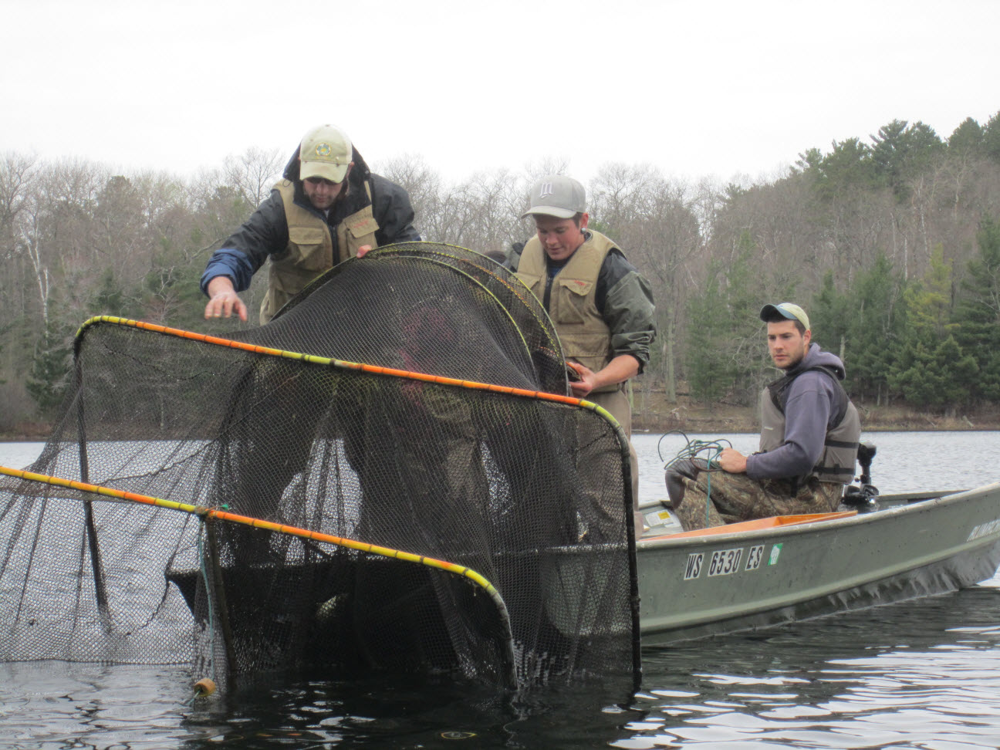

  
Special Note

  
This Case is a modification of Case 16 by <a href="http://www.sdstate.edu/nrm/people/willis.cfm">Dr. David Willis</a> from <a href="https://fisheries.org/shop/55062p"><i>Case Studies in Fisheries Conservation & Management: Applied Critical Thinking & Problem Solving</i></a>. Much of the text is exactly as it appeared in the original Case chapter, though slightly rearranged.

----

## Background
#### Motivation
Students (and biologists for that matter!) have a tendency to accept sampling data at face value. If a gear type primarily collects small fish then they assume the population is dominated by small fish. If a gear type captures big fish and lots of them then they assume that the population is dominated by large fish. In reality, many biases are possible and are actually very common. To truly understand sampling data, biologists must first understand the biases associated with each gear, and only then will the true nature of the population's structure (e.g., size or age structure) and dynamics (i.e., recruitment, growth, and mortality) be revealed.

Various sampling gears may be differentially effective for different species, and even differentially effective for different sizes of the same species. For example, Largemouth Bass are commonly sampled with electrofishing gear. The numbers and sizes of Largemouth Bass collected can vary widely across seasons. During the spring and fall, more and larger Largemouth Bass tend to be nearshore and vulnerable to the electrofishing gear, which is used in that shallow-water habitat. During midsummer, fewer Largemouth Bass would be sampled at the same locations because many of the larger bass will have moved offshore to deeper water as a result of the warm summer water temperatures.

In this case study, you will explore the differential size structure of Bluegills captured by two common sampling gears -- electrofishing and trap nets (also known as modified fyke nets).

&nbsp;

#### Data
[Lake Louise](http://gfp.sd.gov/state-parks/directory/lake-louise/) is a 45-ha impoundment located in Hand County, South Dakota. The maximum depth is 6.5 m with a mean depth of 2.7 m. Fish were sampled with trap nets that had 1.2- X 1.5-m frames, dual throats, and 19-mm bar mesh. Night electrofishing was undertaken with pulsed DC electricity at approximately 250 V and 8 A. Samples were collected in late May at a water temperature of 23$^{o}$C.

The total length (TL; mm) of each Bluegill was recorded for fish captured in both gears in the `LenData` sheet of [LakeLouiseBG.xlsx](../RESOURCES/LakeLouiseBG.xlsx)). The variables in this data frame are defined as follows,

* `len`: The TL (mm) of the sampled fish.
* `gear`: A factor indicating the gear used to capture the fish. Choices are `A` and `B` (described later).

&nbsp;

## Preparation
Prior to beginning this case study you should:

* Read [Laarman and Ryckman (1982)](Laarman_Ryckman_1982.pdf) and [Schultz and Haines (2005)](Schultz_Haines_2005.pdf). Both of these papers deal with length-related biases for sampling Bluegills (the latter article deals with other species as well). As you read these articles, concentrate on the gear bias for 8-cm and longer Bluegills (Bluegills smaller than this length are not reliably sampled by these gears).
* Be familiar with methods of comparing distributions of fish length (e.g., see Section 6.4.1 of the [IFAR book](http://derekogle.com/IFAR/)).
* You should open the Excel file described above and save `LenData` as a CSV file. Then create a script that reads the CSV file into an object in R and displays the structure and a few rows of the data.frame.

&nbsp;

## Analysis Questions
Construct length-frequency histograms and summary statistics separately for each gear using the same x-axis limits on each graph. Additionally, plot the cumulative distribution function for each gear and compute the Kolmogorov-Smirnov test of the differences between the two distributions.

Use thes results to answer the following questions.

1. Is there a significant difference in the distribution of lengths between the two gears? If so, describe the difference. Use two different types of graphics to present your results.
1. Is there a significant difference in the mean or median lengths between the two gears?
1. Identify which gear -- trap nets or electrofishing -- that corresponds to gear `A` and gear `B`, respectively. Explain your reasoning for your choices.
1. Explain at least two different conclusions you might have made if you had used one gear exclusively over the other. How might this have impacted a management decision.

&nbsp;

## Analysis & Interpretation Questions II
Construct similar length- and age-frequency histograms and PSD and PSD-P calculations for each species from the **POST-ANGLING** period. Use this information to answer the following questions.

{:start="5"}
1. Assess the length- and age-frequency histograms for Bluegill, Pumpkinseed, Yellow Perch, and Largemouth Bass from Mid Lake after angler exploitation was allowed.
1. Write a clear paragraph, for each species, that compares the pre- and post-angling size- and age-structure results.
1. How did your summaries from the previous question compare to your expectations from before seeing the post-angling results? Suggest possible reasons for any differences.
1. How do you suppose the annual mortality rate differed between the two periods for each species? Use specific evidence to support your supposition.

