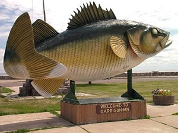

----

## Lake Mille Lacs Walleye Fishery Management

[Lake Mille Lacs](https://en.wikipedia.org/wiki/Mille_Lacs_Lake) is one of the "large lakes" in Minnesota.  Traditionally it was known as a "walleye factory" because of its consistent production of [Walleye (*Sander vitreus*)](https://en.wikipedia.org/wiki/Walleye).  However, the Lake Mille Lacs Walleye fishery was [temporarily shut down this year](http://www.startribune.com/dnr-closure-of-walleye-fishing-season-imminent-on-mille-lacs/320427622/#1) to protect the dwindling stock of Walleye.  [Local businesses were hurt](http://www.mprnews.org/story/2015/08/31/dnr-mille-lacs) and claimed years of mismanagement by the Department of Natural Resources (DNR), including [suing the DNR](http://www.twincities.com/localnews/ci_25632529/minnesota-dnr-sued-over-management-lake-mille-lacs).  The DNR suggested that a mixture of factors had caused the decline.  Public meetings were held to discuss the issue and Governor Dayton ultimately became involved in the controversy, even [calling for a special session of the Minnesota legislature](http://www.mprnews.org/story/2015/07/28/millelacs-session).  Politicians and government administrators decided that the local citizens had lost faith in the local DNR.  In an attempt to address this finding, they created a new DNR Office focused solely on the management of the fisheries resources of Lake Mille Lacs and [a panel of interested parties to provide input](http://www.startribune.com/broad-based-advisory-committee-to-work-with-dnr-on-mille-lacs-issues/330985141/).

Suppose that you were hired to be the lead biologist for this new DNR Office.  List everything that you would need to know about Lake Mille Lacs and its Walleye fishery to effectively manage it.

----
