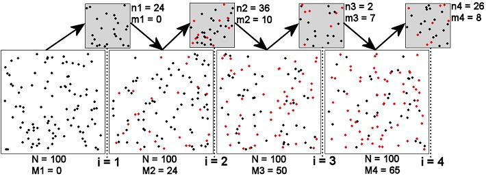

```{r echo=FALSE, eval=FALSE}
# First line renders an appropriate HTML file for the webpage
# Second line makes the script file
# RUN BOTH MANUALLY (following using Knit HTML button)
setwd("C:/aaaWork/Web/GitHub/NCNRS349/modules/Abundance/MarkRecap/")
source("../../../rhelpers/Rhelpers.R")
modHTML("BKG_Schnabel",need2render=FALSE)
if (require(FSA)) purl2("BKG.Rmd",topnotes="")
```

```{r echo=FALSE, results='hide', message=FALSE, warnings=FALSE}
#### #### #### #### #### #### #### #### #### #### #### #### #### #### #### ##
# ===== BEGIN -- THIS CAN BE IGNORED =========================
# Setup of knitr
source("../../../rhelpers/knitr_setup.R")
# declare packages used
rqrd <- c("FSA","captioner","knitr")
library(FSA)
# setup figure, table, and equation captioning
library(captioner)

tblcaps <- captioner(prefix="Table")
tblcaps("SchnabelNotation","Summary of notation used in the Schnabel and Schumacher-Eschmeyer methods.")

figcaps <- captioner(prefix="Figure")
figcaps("SchnabelScheme","Schematic representation of a hypothetical four samples ($i=1,2,3,4$) in a Schnabel or Shumacher-Eschmeyer mark-recapture study.  See the text for detailed description and Table 3 for definitions of notation.")

eqncaps <- captioner(prefix="Equation")
eqncaps("SchnabelChapman")
eqncaps("SchumacherEschmeyer")

# ===== END -- THIS CAN BE IGNORED ===========================
#### #### #### #### #### #### #### #### #### #### #### #### #### #### #### ##
```


# Multiple Census Closed Population Mark-Recapture

### Background

The population and sampling scheme for multiple sample methods on a closed population is shown in  `r figcaps("SchnabelScheme",display="cite")`.  The setup of this figure is the same as that for the Petersen method `r figcaps("PetersenScheme",display="cite")`, except that it is extended for more than two samples.  Note in this scheme that the population immediately after the $i$th sample is the same as the population immediately before the $(i+1)$th sample because the population is assumed closed.

For each sample period ($i$) a total of $n_{i}$ fish are captured.  Each of the captured fish must be observed to have a mark or not.  The total number of marked fish in the $i$th sample is denoted with $m_{i}$, whereas the number of unmarked fish is $u_{i}$.  Immediately following the extraction of the $i$th sample, a total of $R_{i}$ marked fish are returned to the population.  The $R_{i}$ marked fish consists of the $m_{i}$ previously marked fish plus the $u_{i}$ previously unmarked but now newly marked fish, minus any accidental deaths of fish captured in the $i$th sample.  The accidental deaths should be kept negligible as it is assumed, with these methods, that the population is closed.  Thus, $R_{i}$ is typically equal to $m_{i}+u_{i}$.  A summary of the notation used in these methods is shown in `r tblcaps("SchnabelNotation",display="cite")`.

\ 



`r figcaps("SchnabelScheme")`

\ 

`r tblcaps("SchnabelNotation")`

Symbol   | Meaning
-------- | -------
$N$      | The unknown size of the population just prior to the first sample.
$k$      | The number of samples in the entire study (i.e., $i=1\ldots k$)
$n_{i}$  | The number of fish captured in the $i$th sample.
$m_{i}$  | The number of marked fish in the $i$th sample.  $m_{1}=0$
$u_{i}$  | The number of unmarked fish in the $i$th sample.
$R_{i}$  | The number of marked fish returned to the population after the $i$th sample.  $R_{k}=0$
$M_{i}$  | The number of marked fish in the population just prior to the $i$th sample.  $M_{1}=0$
$\widehat{N}$ | The estimated size of the population just prior to the first sample.

\ 

The two multiple-sample closed population methods to be discussed also rely on determining the number of marked fish extant in the population just prior to taking the $i$th sample, $M_{i}$.  Because these methods assume a closed population, this task is as simple as accumulating the number of previously unmarked fish returned to the population as marked fish prior to the $i$th sample.  Thus, $M_{i}=\sum_{j=1}^{i-1}u_{j}$, or if there is the possibility of some accidental deaths, $M_{i}=\sum_{j=1}^{i-1}\left(R_{j}-m_{j}\right)$.  By definition, $M_{1}=0$ because there are no marked fish in the population just prior to the first sample, .

These summary values -- $n_{i}$, $m_{i}$, $u_{i}$, $R_{i}$, and $M_{i}$ -- may be recorded directly from each sample or they may be deciphered from summaries of individual capture histories.  For example, suppose that the frequencies of fish in each possible capture history is,

<pre>
Capture history  001 010 011 100 101 110 111
Number of Fish   198 171  73  54   4  15   2
</pre>

and there were no recorded accidental deaths.  From this summary of capture histories, the required summary statistics can be calculated.  For example,

* the number of fish captured in the first sample is $n_{1} = n_{1\cdot\cdot} = n_{100}+n_{101}+n_{110}+n_{111} = 54+4+15+2 = 75$
* the number of fish captured in the second sample is $n_{2} = n_{\cdot 1\cdot} = n_{010}+n_{011}+n_{110}+n_{111} = 171+73+15+2 = 261$
* the number of already marked fish captured in the second sample is $m_{2} = n_{11\cdot} = n_{110}+n_{111} = 15+2 = 17$
* the total number of marked fish released immediately after the first sample is $R_{1} = m_{1}+u_{1}-\text{"accidental deaths"} = 0+75-0 = 75$
* the total number of marked fish released immediately after the second sample is $R_{2} = m_{2}+u_{2}-\text{"accidental deaths"} = 17+244-0 = 261$
* the number of marked fish just before the second sample is taken $M_{2} = M_{1}+\left(R_{1}-m_{1}\right) = 0+(75-0) = 75$
* the number of marked fish just before the third sample is taken $M_{3} = M_{2}+\left(R_{2}-m_{2}\right) = 75+(261-17) = 319$

These calculations, along with the remaining calculations not shown (i.e., $n_{3}$ and $m_{3}$) and the default values ($m_{1}=0$, $R_{3}=0$, and $M_{1}=0$), can be summarized in the following table,

<pre>
        ni mi  Ri  Mi
first   75  0  75   0
second 261 17 261  75
third  277 79 277 319
</pre>

It should be noted that $R_{i}=n_{i}$ only if there are no accidental deaths reported as was the case with this example. Again, it is possible for $R_{i} < n_{i}$, but $R_{i}$ should not be substantially lower than $n_{i}$.

### Schnabel Method
The Schnabel equation for estimating $N$ is 

$$ \hat{N} = \frac{\sum_{i=1}^{k}n_{i}M_{i}}{\sum_{i=1}^{k}m_{i}} \quad \quad \text{`r paste0("(",eqncaps("Schnabel",display="num"),")")`} $$

The Schnabel estimation formula is very similar in form to `r eqncaps("Petersen",display="cite")`.  In fact, @Krebs1999 noted that `r eqncaps("Schnabel",display="cite")` is basically a weighted average of individual Petersen estimates.

@Chapman1954 noted that `r eqncaps("Schnabel",display="cite")` provides a slightly biased estimate of $N$.  Therefore, he suggested that `r eqncaps("Schnabel",display="cite")` be modified with the inclusion of a 1 in the denominator,

$$ \hat{N} = \frac{\sum_{i=1}^{k}n_{i}M_{i}}{\left(\sum_{i=1}^{k}m_{i}\right)+1} \quad \quad \text{`r paste0("(",eqncaps("SchnabelChapman",display="num"),")")`} $$

@Krebs1999 suggested that the Chapman modification of the Schnabel method should be used if the proportion of the total population caught in each sample (i.e., $\frac{n_{i}}{\hat{N}}$) is less than 0.1 and if the proportion of the population that is marked ($\frac{M_{i}}{\hat{N}}$) is always less than 0.1.  As a default, we suggest that the Chapman modification should be used at all times.

@Ricker1975 and @Krebs1999 suggest two possible methods for constructing confidence intervals for $N$ with the Schnabel method.  First, if $\sum m_{i}$ is small (i.e., $<50$) then a Poisson approximation for constructing a confidence interval for $\sum m_{i}$ is used and the endpoints substituted into `r eqncaps("Schnabel",display="cite")` or `r eqncaps("SchnabelChapman",display="cite")` to construct confidence endpoints for $N$ (note that the confidence interval for $\sum m_{i}$ is constructed in the same manner as the confidence interval for $m$ in the Petersen method).  Alternatively, when $\sum m_{i}$ is large then a confidence interval is constructed for $\frac{1}{N}$ using standard confidence interval methods and

$$ SE_{\frac{1}{\hat{N}}} = \sqrt{\frac{\sum_{i=1}^{k}m_{i}}{\left(\sum_{i=1}^{k}n_{i}M_{i}\right)^{2}}} $$

with $df=n-2$.


### Schumacher-Eschmeyer Method

@SchumacherEschmeyer1943 provided a separate estimation function for $N$,

$$ \hat{N} = \frac{\sum_{i=1}^{k}n_{i}M_{i}^{2}}{\sum_{i=1}^{k}m_{i}M_{i}} \quad \quad \text{`r paste0("(",eqncaps("SchumacherEschmeyer",display="num"),")")`} $$

that is based on minimizing the weighted sum-of-squares between the the proportion of marked animals in a sample (i.e., $\frac{m_{i}}{n_{i}}$) and the unknown proportion of marked animals in the population.

The standard error of the reciprocal of this estimate is

$$ SE_{\frac{1}{\hat{N}}} = \sqrt{\frac{\sum\frac{m_{i}^{2}}{n_{i}}-\frac{\left(\sum m_{i}M_{i}\right)^{2}}{\sum n_{i}M_{i}^{2}}}{(k-2)\sum n_{i}M_{i}^{2}}}  $$

where all of the summations extend from $i=1$ to $i=k$ and $k$ is the number of samples.  The confidence interval for $N$ is constructed by inverting the endpoints of the confidence interval for $\frac{1}{N}$ computed as usual with the standard error shown here.

### Assumptions of Schnabel & Schumacher-Eschmeyer Methods

The Schnabel and Schumacher-Eschmeyer methods rest on the same assumptions as the Petersen method.  Thus, the discussion of the effect of violating assumptions of the Petersen method pertains also to the Schnabel and Schumacher-Eschmeyer methods.  One advantage of these multiple census methods is that violations of the assumptions are more easily detected because of the multiple samples.  The primary diagnostic tool for these methods is the plot of $\frac{m_{i}}{n_{i}}$ against $M_{i}$.  If this plot is not linear then one or more of the assumptions of the Schnabel and Schumacher-Eschmeyer methods has been violated.  Unfortunately, the shape of the graph is not an indication of which assumption is violated (thus, the conclusion is that an assumption has been violated but it is not clear which one).


### Calculations in R

Methods for performing the Schnabel and Schumacher-Eschmeyer methods in R are described in Section 9.2 of @Ogle2016.[^IFARScripts]

\ 

--------------------------------------------------------------

```{r echo=FALSE, results='asis'}
reproInfo(rqrdPkgs=rqrd,out="markdown",links=c(Script="BKG.R",RMarkdown="BKG.Rmd"))
```

--------------------------------------------------------------

\ 

## References

[^IFARScripts]: Scripts for these calculations [are here](http://derekogle.com/IFAR/scripts/).
