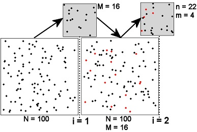
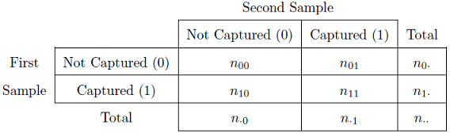

```{r echo=FALSE, eval=FALSE}
# First line renders an appropriate HTML file for the webpage
# Second line makes the script file
# RUN BOTH MANUALLY (following using Knit HTML button)
setwd("C:/aaaWork/Web/GitHub/NCNRS349/modules/PREP/NOTES/")
source("../../../rhelpers/Rhelpers.R")
modHTML("MarkRecapture1",need2render=FALSE)
if (require(FSA)) purl2("MarkRecapture1.Rmd",topnotes="")
```

```{r echo=FALSE, results='hide', message=FALSE, warning=FALSE}
#### #### #### #### #### #### #### #### #### #### #### #### #### #### #### ##
# ===== BEGIN -- THIS CAN BE IGNORED =========================
# Setup of knitr
source("../../../rhelpers/knitr_setup.R")
# declare packages used
rqrd <- c("FSA","captioner","knitr")
library(FSA)
# setup figure, table, and equation captioning
library(captioner)

tblcaps <- captioner(prefix="Table")
tblcaps("PetersenDataMatrix","Summary data matrix for the two samples in a Petersen mark-recapture framework. Note that a zero indicates the fish were not captured in that sample and a one indicates that the fish were captured in that sample.")
tblcaps("PetersenNotation","Summary of notation used in the Petersen method.")

figcaps <- captioner(prefix="Figure")
figcaps("PetersenScheme","Schematic representation of the two samples ($i=1,2$) in a Petersen mark-recapture study. See the text for detailed description and Table 2 for definitions of notation.")

eqncaps <- captioner(prefix="Equation")
eqncaps("Petersen")
eqncaps("Chapman")
eqncaps("Bailey")

# ===== END -- THIS CAN BE IGNORED ===========================
#### #### #### #### #### #### #### #### #### #### #### #### #### #### #### ##
```

The size of a population can be estimated by capturing individuals from the population, marking those individuals and returning them to the population, extracting another sample from the population, and determining the fraction of individuals in the second sample that had the mark from the first sample. This idea was first used to estimate the population of humans in London in 1662 [@Krebs1999], but was popularized in fisheries by C.G.J. Petersen in 1896 [@Ricker1975]. The method was used by @Lincoln1930 for estimating duck populations and by @Jackson1933 for estimating tsetse fly populations. Thus, this method is variously referred to as the Petersen method, the Lincoln-Petersen method, or the Lincoln-Petersen-Jackson method. "Petersen method" will be used here

The Petersen method, which relies on only one sample of potentially marked fish, can be extended to a series of samples. These extended methods, called the Schnabel and Schumacher-Eschmeyer methods, require at least one sample where fish are marked and then multiple samples of potentially marked fish. However, these methods are most often used when the unmarked fish in the subsequent samples are marked and returned, along with the previously marked fish, to the population. Thus, these methods can be used with multiple marking and multiple "recapturing" samples.

### Some Notational Conventions

The discusson below requires counting the frequency of individuals with each capture history. These frequencies are typically symbolized with a lower-case "n" and the capture history string as a subscript. For example, $n_{10100}$ represents the number of fish captured in the first and third sample periods but not in any other sample period.

This terminology is extended to represent other frequencies by including a "dot" (i.e., $\cdot$) in any part of the subscript that is "summed across."  For example, $n_{\cdot\cdot1\cdot\cdot}$ represents the frequency of fish that were captured in the third sample (i.e., a "1" in the third sample position) and either were or were not captured in any of the other samples. In other words, $n_{\cdot\cdot1\cdot\cdot}$ represents the total number of fish captured in the third sample. Traditionally, this value is also referred to as $n_{3}$, where the subscript now represents the sample number and not a capture history type. As another example, $n_{\cdot101\cdot}$ represents the number of fish captured in the fourth sample that were *last* captured in the second sample. These and other counts will have specific symbols when used in the context of the specific methods below.

\ 

----

# Single Census Mark-Recapture Methods

### Petersen Method
The Petersen method consists of two samples from a closed population and is, thus, the simplest of the broad array of mark-recapture techniques for estimating animal abundance. The population and sampling scheme for the two samples ($i=1,2$) of the Petersen method are represented in `r figcaps("PetersenScheme",display="cite")`. The large squares just to the left of the "i=" vertical lines represent the population just before the $i$th sample is taken. The large square just after the "i=1" vertical line represents the population just after the first sample was taken. Thus, under the assumption that the population is closed, the population immediately after the first sample is the same as the population immediately before the second sample. The samples are represented by the small grey boxes just above each "i=" vertical line.



`r figcaps("PetersenScheme")`

\ 

The population initially consists of all unmarked animals. All fish in the first sample are then marked and returned to the population. The first sample does not necessarily need to be a random sample of the population although the assumptions for the second sample are more likely to be met if it is. In addition, the fish can receive a batch mark, i.e., each fish does not need to be uniquely identified.[^1] The second sample must be a random sample from the entire population of marked and unmarked  individuals such that each fish, whether marked or unmarked, has the same chance of being captured. This also implies that the marked fish mix randomly with the unmarked fish in the population (`r figcaps("PetersenScheme",display="cite")`). Each fish in this second sample is examined to determine if it has the mark from the first sample or not.

The summary data for a Petersen estimate can be shown in the format of capture histories (`r tblcaps("PetersenDataMatrix",display="cite")`). However, the more traditional notation of $N=n_{\cdot\cdot}$, $M=n_{1\cdot}$, $n=n_{\cdot 1}$, and $m=n_{11}$ for ease of comparison to other sources will be used throughout these notes.[^2] Remember that the capitalized symbols refer to the population (i.e., $N$ is number of fish in the population, $M$ is the number of marked fish in the population) whereas the lower-case letters refer to the second sample (i.e., $n$ is the number of fish captured in the second sample, $m$ is the number of marked fish captured in the second sample). The meaning of the symbols used in the Petersen method are shown in `r tblcaps("PetersenNotation",display="cite")`.

\ 

`r tblcaps("PetersenDataMatrix")`



\ 

`r tblcaps("PetersenNotation")`

Symbol   | Meaning
-------- | ---------------------------------------------------------------------
$N$      | The unknown size of the population just prior to the first sample.
$M$      | The number of fish from the first sample that were marked and returned to the population.
$n$      | The number of fish in the second sample.
$m$      | The number of marked fish in the second sample.
$\widehat{N}$ | The estimated size of the population just prior to the first sample.

\ 

The Petersen estimate of abundance can be derived from an assumption that if the second sample is a random sample of the population of marked and unmarked animals, then the proportion of marked animals in the second sample should equal the proportion of marked animals in the population, i.e.,

\[ \frac{m}{n} = \frac{M}{N} \]

A rearrangement of this equality gives an estimate of the size of the population, i.e.,

$$ \hat{N} = \frac{Mn}{m} \quad \quad \text{`r paste0("(",eqncaps("Petersen",display="num"),")")`} $$

Thus, the total population size can be estimated from the number of marked animals, the number of animals observed in the second sample, and the number of animals in the second sample that had the mark.

Approximate confidence intervals for $N$ are often used, with the specific form of the approximation depending on characteristics of the number of marked and recaptured fish.[^3] @Seber1982 suggested the following sequential "rules" (i.e., stop at the step where you answer "yes") for choosing the method for approximating the confidence interval for $N$ in the Petersen method:

* Is the fraction of marked fish in the second sample "large" (i.e., $\frac{m}{n}>0.10$)? -- Use the **binomial** approximation?
* Is the number of marked fish in the second sample "large" (i.e., $m>50$)? -- Use the **normal** approximation?
* Use the **Poisson** approximation.

Both the binomial and normal approximation methods identify a confidence interval for the ratio of marked fish in the second sample (i.e., $\frac{m}{n}$) and then the endpoints of these intervals are substituted into the modified Petersen equation,

$$ \hat{N} = \frac{Mn}{m} = \frac{M}{\frac{m}{n}} $$

to derive endpoints of the confidence interval for $N$. The binomial approximation method constructs the interval for $\frac{m}{n}$ with computer algorithms of the binomial distribution. The normal approximation is considered a large-sample method where the standard error for $\frac{m}{n}$ is estimated with

$$ SE_{\frac{m}{n}} = \sqrt{\left(1-\frac{m}{M}\right)\frac{\frac{m}{n}\left(1-\frac{m}{n}\right)}{n-1}} + \frac{1}{2n} $$

The confidence interval is then constructed in the usual way with $\frac{m}{n}\pm Z^{*}SE_{\frac{m}{n}}$.

The Poisson approximation operates similarly, except that it uses computer algorithms of the Poisson distribution to construct a confidence interval for $m$, the endpoints of which are then substituted back into `r eqncaps("Petersen",display="cite")` to derive the confidence interval for $N$.

### Modifications of the Petersen Method
The Petersen method of estimating abundance is the best asymptotically normal estimator as $N$ approaches infinity but, unfortunately, it is biased, especially for small samples. @Chapman1951 showed that when $M+n \geq N$ that

$$  \hat{N} = \frac{(M+1)(n+1)}{(m+1)}-1 \quad \quad \text{`r paste0("(",eqncaps("Chapman",display="num"),")")`} $$

is an exactly unbiased estimator of $N$.[^4]  If $M+n < N$, then @RobsonRegier1964 showed that the bias of `r eqncaps("Chapman",display="cite")` is less than 2\% if $\frac{Mn}{N}>4$. Unfortunately, $N$ is usually unknown. However, @RobsonRegier1964 note that if $m\geq7$ then there is a 95\% chance that $\frac{Mn}{N}>4$ and the bias of `r eqncaps("Chapman",display="cite")` can be considered negligible [@Seber1982]. Thus, a given study should be designed so that enough fish are marked and the second sample is large enough to ensure that more than seven marked fish are recaptured.

A final modification was proposed by @Bailey1951 and @Bailey1952. Bailey's method is appropriate if the second sample of fish is collected with replacement (i.e., an individual may be counted more than once). This type of sampling happens most often if the tagged fish are simply observed rather than captured. Bailey showed that `r eqncaps("Petersen",display="cite")` is biased under these conditions and that his modified estimator,

$$ \hat{N} = \frac{(M)(n+1)}{(m+1)} \quad \quad \text{`r paste0("(",eqncaps("Bailey",display="num"),")")`} $$

is nearly unbiased if $m\geq7$.

Confidence intervals for $N$ from these modified estimators use techniques similar to those described for the Petersen method. However, the binomial and normal confidence intervals for the ratio $\frac{m}{n}$ must be converted to a confidence interval for $m$ by multiplying the endpoints by $n$. The endpoints of the confidence interval for $m$ are then substituted into `r eqncaps("Chapman",display="cite")` or `r eqncaps("Bailey",display="cite")` to obtain confidence intervals for $N$.

\ 

--------------------------------------------------------------

```{r echo=FALSE, results='asis'}
reproInfo(rqrdPkgs=rqrd,out="markdown",
          links=c(Script="MarkRecapture1.R",RMarkdown="MarkRecapture1.Rmd"))
```

--------------------------------------------------------------

\ 

## References

[^1]: However, it is generally beneficial to uniquely tag each fish.
[^2]: The most traditional notation uses $C=n_{\cdot 1}$, and $R=n_{11}$. We do not use this notation in order to maintain continuity with subsequent mark-recapture methods.
[^3]: Exact confidence intervals for $N$ can generally be derived from the hypergeometric distribution underlying the likelihood function. Unfortunately, there is no simple cumulative distribution for the hypergeometric distribution.
[^4]: @Ricker1975 modified the Chapman estimator by ignoring the "-1" at the end of the right-hand-side of `r eqncaps("Chapman",display="cite")`. His argument was that subtracting one is of no practical importance in the estimate. While this argument is understandable, subtracting one to get the exact result proposed by Chapman is not onerous. Therefore, I suggest using the full estimator as proposed by @Chapman1951.
