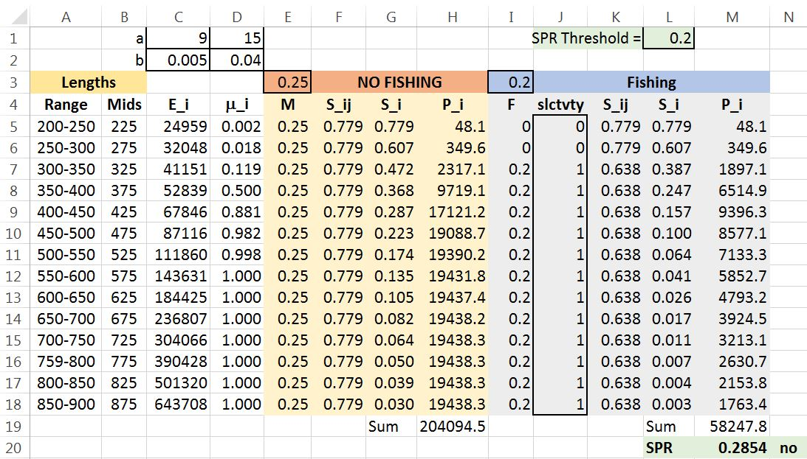

```{r echo=FALSE, eval=FALSE}
# First line renders an appropriate HTML file for the webpage
# RUN MANUALLY (following using Knit HTML button)
setwd("C:/aaaWork/Web/GitHub/NCNRS349/modules/Recruitment/Cases/")
source("../../../rhelpers/Rhelpers.R")
modHTML("SPR",need2render=FALSE)
```

----

## Introduction

The spawning potential ratio (SPR) is a metric used to examine how lifetime egg production ($P$) is affected by different management scenarios.  It is computed as the ratio of lifetime egg production under exploitation divided by lifetime egg production with no exploitation; e.g.,

\[ SPR=\frac{P_{exploited}}{P_{unexploited}} \]

Lifetime egg production is computed with

\[ P = \sum_{i=1}^{n} \mu_{i}E_{i}S_{i} \]

where $n$ is the number of groups in the population (ages or length categories), $\mu_{i}$ is the proportion of females in the $i$th group that are mature, $E_{i}$ is the mean fecundity (number of eggs) in the absence of density-dependent effects on growth, maturity, or fecundity for mature females in the $i$th group, and $S_{i}$ is the cumulative survival rate (i.e., survivorship) of females from hatch to the $i$th group.  The $S_{i}$ are computed as
 
\[ S_{i} = \prod_{j=0}^{i-1} S_{ij}  \]

where $S_{ij}$ is the annual rate of survival of females in the $i$th group when they were in the $j$th group.  The $S_{ij}$ are equal to $e^{F_{ij}+M_{ij}}$ where $F_{ij}$ is the instantaneous fishing mortality and $M_{ij}$ is the instantaneous natural mortality of females in the $i$th group when they were in the $j$th group.

As a very general rule-of-thumb, it has been suggested that populations with SPR values greater than 0.20 or 0.30 will not suffer recruitment over-fishing.

\ 

## Motivation

One method of controlling some invasive species is to develop extract-and-kill fisheries for those fish.  It has been suggested that such a method could use commercial fishers on the Mississippi River to control invasive [Silver Carp (*Hypophthalmichthys 
molitrix*)](https://en.wikipedia.org/wiki/Silver_carp).  For example, [it has been proposed](http://www.reabic.net/journals/mbi/2015/3/MBI_2015_Seibert_etal.pdf) that commercial fishers could be paid for the biomass of Silver Carp that they removed from the Mississippi River.  An open question, though, is whether commercial fishers can remove enough Silver Carp to effectively reduce the population (while still making it worth their while commercially).  One way to answer this question is to determine if commericial fishers could realistically force the SPR below 0.20, a value that would lead to recruitment over-fishing and, in theory, a collapse of the population.


\ 

## Create a Model

Suppose that a population of Silver Carp ...

<ul>
  <li>is vulnerable to harvest by commercial fishers for total lengths between 200 and 900 mm,</li>
  <li>has an instantaneous natural mortality of 0.25,</li>
  <li>has a maturity schedule that follows this equation -- $PR(mature)=\frac{1}{1+e^{15-0.04*TL}}$, and</li>
  <li>has a fecundity-length relationshop that follows this equation -- $Fecundity=e^{9+0.005*TL}$.
</ul>

Use this information to create a spreadsheet model that can be used to compute the SPR under various levels of instantaneous fishing mortality ($F$) and gear selectivities.  Your model should model lengths as the center of 50-mm length categories (e.g., use 225 mm to represent the 200-250 mm category) and be flexible enough for you to input different values of $F$ and selectivities to see the effect on SPR.

Your spreadsheet might look like that below.



\ 

## Scenarios

Use your spreadsheet model from above to answer the following questions.  All answers should be to two decimal places for $F$ and whole (midpoint category) numbers for total lengths.

<ol>
<li>Determine the value of $F$ that would meet the management goal for each situation below.  Comment on how realistic it would be to reach that level of $F$.</li>
<ol type="a">
<li>The fishers use a gear that is fully selective for all lengths of fish.</li>
<li>The fishers use a gear where selectivity increases linearly from 0 for 200 mm fish to 1 for 450 mm and all larger fish.</li>
<li>The fishers get paid according to the biomass (not numbers) of carp collected and, thus, they do not want to waste their handling small (lower weight) fish.  Suppose that they choose to use a gear that fully selects carp over 600 mm, does not select any fish less than 550 mm, and selects half of the 550-600 mm fish.</li>
<li>Suppose that you negotiate with the fishers to use a gear that selects all fish greater than 450 mm and half of the 400-450 mm fish.</li>
</ol>
<li>Determine the minimum length of fish to capture for each situation below, assuming that the fishers will use a gear that has "knife-edge" selectivity.</li>
<ol type="a">
<li>The fishers can expend enough effort to reach $F=0.5$.</li>
<li>The fishers can expend enough effort to reach $F=0.8$.</li>
<li>The fishers can expend enough effort to reach $F=1.0$.</li>
</ol>
<li>If the fish were to mature somewhat later (e.g., change the slope for the maturity schedule from 0.04 to 0.025), then is it more or less difficult for the fishers to drive the population towards recruitment over-fishing.  Provide direct evidence for your conclusion.
</ol>


----

<style>
img[alt="SilverCarp"], img[alt="AsianCarp"] { 
  max-width: 400px; 
  display: block;
  margin: 0 auto;
}

img[alt="ExExcel"] { 
  max-width: 700px; 
  display: block;
  margin: 0 auto;
}
</style>
