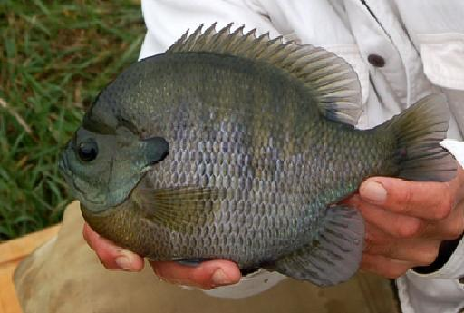

```{r echo=FALSE, eval=FALSE}
# Renders an appropriate HTML file for the webpage
setwd("C:/aaaWork/Web/GitHub/NCNRS349/modules/SizeStructure/Cases/")
source("../../../rhelpers/rhelpers.R")
fnm <- "GoeddeCoble"
modHTML(fnm)
```

```{r echo=FALSE, results='hide', message=FALSE}
source("../../../rhelpers/knitr_setup.R")
```

----

<div class="panel panel-primary">
  <div class="panel-heading">Special Note</div>
  <div class="panel-body">This Case is a modification of Case 4 by <a href="http://www.sdstate.edu/nrm/people/willis.cfm">Dr. David Willis</a> from <a href="https://fisheries.org/shop/55062p"><i>Case Studies in Fisheries Conservation & Management: Applied Critical Thinking & Problem Solving</i></a>.  Much of the text is exactly as it appeared in the original Case chapter, though slightly rearranged.</div>
</div>

----

## Background

#### Motivation

The effect of angling on fish population size structure is dependent on a myriad of factors, such as population abundance, the amount of angling effort, the size of the water body, and even differential vulnerability of different fish species.  The opportunity to study unexploited populations can be extremely valuable, including situations where subsequent angler harvest is then assessed.  Data sets for unexploited populations tend to be relatively rare.  Information on unexploited populations can provide our profession with valuable examples of just what is possible when a population is not exploited.  That way, realistic (i.e., feasible) management objectives might be set for various harvest regulations that fishery biologist might select.  In this case study, you will explore the effects of angling on a previously unexploited fish community in a small Wisconsin Lake.



\ 

#### Setting

Mid Lake (4.7 ha; <a href="http://dnr.wi.gov/lakes/maps/DNR/0263900a.pdf">map</a>) is one of a series of small lakes in <a href="http://dnr.wi.gov/topic/parks/name/hartman/">Hartman Creek State Park</a>, Wisconsin.  The maximum lake depth is 1.8 m and given the relatively clear water that allowed light penetration to the entire lake bottom, submergent vegetation growth was abundant throughout the lake.  The fish community in Mid Lake included Bluegill (*Lepomis macrochirus*), Largemouth Bass (*Micropterus salmoides*), Northern Pike (*Esox lucius*), Pumpkinseed (*Lepomis gibbosus*), and Yellow Perch (*Perca flavescens*).

The lake was closed to all fishing from 1938 to 1976.  On 1-May-1976, anglers were permitted to harvest any fish species, with seasons extending from early May through February.  There was no length limits on harvested fish, and daily creel limits were liberal (five per day for Largemouth Bass, five per day for Northern Pike, and 50 per day for panfish).  Random stratified creel surveys indicated angling effort of 230 hours/ha in 1976 and 62 hours/ha in 1979.

#### Data

Fish populations were surveyed over a 6-year period.  Samples in 1974-1976 represented unfished populations (i.e,. "pre-angling""), whereas samples in 1977-1979 were from fished populations (i.e., "post-angling"").  Electrofishing samples were collected every spring and fyke nets were set in 1976 and 1979.  Electrofishing was carried out at night with a 230-volt direct- or alternating-current shocker with the entire perimeter of the lake traversed each time.  The six fyke nets (856 to 1,000 net-hours in each sampling year) were of 5-cm stretched mesh with leads of 12 to 18 m.  Captured fish were measured (total length (TL), mm), weighed (g), and finclipped; scale samples were collected, and the fish were released.  Ages were determined for Bluegills, Pumpkinseeds, Yellow Perch, and Largemouth Bass from 1974 through 1978 and from Yellow Perch in 1979.

Data from before and after the regulation change were stored in the `LenAge` sheet of the `GoeddeCobleData.xlsx` Excel 2007 file  ([available from here](GoeddeCobleData.xlsx)).    The variables in this data frame are defined as follows,

* `len`: The TL (mm) of the sampled fish.
* `age`: The assessed scale age (years) of a subsample of the sampled fish.
* `period`: A factor indicating if the sample was from the `pre`-angling or `post`-angling period.
* `species`: A factor indicating the species captured.  Abbreviations are `BLG`=Bluegill, `LMB`=Largemouth Bass, `NOP`=Northern Pike, `PKS`=Pumpkinseed, and `YEP`=Yellow Perch.


\ 

## Preparation

Prior to beginning this case study you should:

* Develop an opinion about what you think the minimum size (in mm) of fish acceptable to anglers and the minimum size of fish preferred by anglers for Bluegill/Pumpkinseed, Yellow Perch, and Largemouth Bass.
* Be familiar with methods for computing size structure metrics (e.g., see Section 6.3 of the [IFAR book](http://derekogle.com/IFAR/)).
* You should open the Excel file described above and save `LenAge` as a CSV file.  Then create a script that reads the CSV file into an object in R and displays the structure and a random six rows of the data.frame.

\ 

## Analysis & Interpretation Questions I

The initial analysis requires constructing length- and age-frequency plots for Bluegill, Pumpkinseed, Yellow Perch, and Largemouth Bass from the **PRE-ANGLING** period.  In addition, the proportional size distribution for quality-length (PSD) and preferred-length fish (PSD-P) should be constructed.  Steps for constructing these summaries are as follows:

1. For each species ...
    1. Isolate the species and **pre-angling** period data using `filterD()`.
    1. Construct the length frequency histogram and PSD-X calculations using `psdPlot()`.
    1. Construct the age frequency histogram using `hist()`.
1. Organize your plots for ease of use.
1. Create a (neat) summary table of PSD and PSD-P values (columns) for each species (rows).

The code below is an example for Bluegill from the "pre-angling" period.

```{r fig.width=7.5, fig.height=3.75, message=FALSE, warning=FALSE}
library(FSA)
d <- read.csv("GoeddeCobleData.csv")
par(mfrow=c(1,2),mar=c(3,3,1.5,1),mgp=c(1.9,0.5,0),tcl=-0.2)
blg.pre <- filterD(d,species=="BLG",period=="pre")
psdPlot(~len,data=blg.pre,species="Bluegill",units="mm",w=10,xlab="Total Length (mm)")
hist(~age,data=blg.pre,breaks=1:10,xlab="Age (years)")
```

Use these results to answer the following questions.

<ol>
  <li>Assess (i.e., make a summary interpretation) the length- and age-frequency histograms for Bluegill, Pumpkinseed, Yellow Perch, and Largemouth Bass from Mid Lake prior to angler exploitation.</li>
  <li>Predict the likely effects of angler exploitation on **size**-structure after angling has been allowed for one year.  Why do you expect such changes?</li>
  <li>Predict the likely effects of angler exploitation on **age**-structure after angling has been allowed for one year.  Why do you expect such changes?</li>
  <li>What percent decline in population abundance (i.e., number of fish) would you predict for each species?  Why do you expect such changes?</li>
</ol>

\ 

## Analysis & Interpretation Questions II

Construct similar length- and age-frequency histograms and PSD and PSD-P calculations for each species from the **POST-ANGLING** period.  Use this information to answer the following questions.

<ol start="5">
  <li>Assess the length- and age-frequency histograms for Bluegill, Pumpkinseed, Yellow Perch, and Largemouth Bass from Mid Lake after angler exploitation was allowed.</li>
  <li>Write a clear paragraph, for each species, that compares the pre- and post-angling size- and age-structure results.</li>
  <li>How did your summaries from the previous question compare to your expectations from before seeing the post-angling results?  Suggest possible reasons for any differences.</li>
  <li>How do you suppose the annual mortality rate differed between the two periods for each species?  Use specific evidence to support your supposition.</li>
</ol>

----

<style>
img[alt="Bluegill"], img[alt="Largemouth"] { 
  max-width: 400px; 
  display: block;
  margin: 0 auto;
}
</style>
